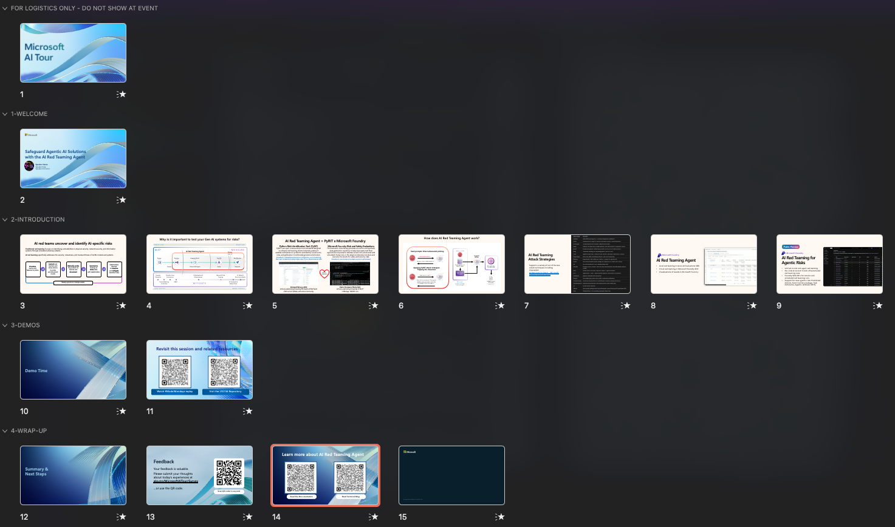

# LTG156 - Speaker Narrative

**Total Session Time: 15 minutes**
- *Slides: 10 minutes*
- *Demo/Summary: 5 minutes*

---

## Slide 1: Welcome to Session
**Time: 30 seconds**

## Slide 3: Introduction to AI Red Teaming
**Time: 2 minutes**

Hello everyone. Today we're talking about AI red teaming and introducing you to the AI Red Teaming Agent.

For those familiar with security, traditional red teaming focuses on identifying vulnerabilities in physical security, network security, and information systems. Red teams act as adversarial attackers, probing software systems to find and exploit vulnerabilities that could lead to unauthorized access.

With the advent of generative AI and agents, we now have AI red teaming, which addresses the security, robustness, and trustworthiness of AI and ML models. Generative AI systems that you can talk to and interact with in diverse ways have significantly expanded the risk surface area beyond traditional software.

A typical red teaming exercise takes many weeks and involves:
- Prioritizing harms and features to probe in your AI system
- Assembling a team of knowledgeable red teamers and stress testers
- Probing the AI system and documenting results
- Summarizing findings and mitigating risks
- Iterating until you're comfortable shipping the product

This process requires significant time and specialized safety and security expertise that not every organization has in-house.

---

## Slide 4: Security Development Lifecycle & Map-Measure-Mitigate Framework
**Time: 2 minutes**

Why is testing your AI system for risks important? Microsoft pioneered the Security Development Lifecycle, and we've added the map, measure, mitigate framework on top of it.

The development lifecycle goes from design to development to building and testing, then deploying to production and monitoring. On the left side, we have proactive and cost-effective measures like:
- Security education
- Threat modeling for AI risks
- Sensitive use case assessment
- Role-based access control

As you build applications, you can use evaluations and measurements to track your system's behavior over time as you iterate and improve your prototype.

Manual AI red teaming traditionally comes at the very end. Imagine getting to the finish line only to discover risks you hadn't accounted for, forcing you back to the drawing board. While manual red teaming is less costly than safety incidents, the AI Red Teaming Agent can automate these tests at almost every step of your development lifecycle, from pre-deployment to post-deployment.

---

## Slide 5: What is the AI Red Teaming Agent?
**Time: 2 minutes**

The AI Red Teaming Agent is a collaboration between two powerful tools:

**PyRIT (Python Risk Identification Tool)**: An open-source automation framework on GitHub, created and maintained by Microsoft's AI red teaming team. It helps identify novel harms and is constantly updated with new attack techniques. Microsoft's own red teaming team uses it to streamline their operations.

**Microsoft Foundry Risk and Safety Evaluations**: Released in 2024, this evaluation client library provides end-to-end synthetic data generation. It creates adversarial seed datasets, tests your application, and evaluates whether attacks were successful. It offers both code-first and no-code UI experiences.

PyRIT had comprehensive attack strategies but lacked evaluation frameworks, while Foundry evaluations needed more novel attack techniques. Together, they form the AI Red Teaming Agent in Microsoft Foundry, the AI application and agentic development platform for builders.

---

## Slide 6: How the AI Red Teaming Agent Works
**Time: 2 minutes**

The AI Red Teaming Agent uses curated seed prompts developed by our research and science team, including collaboration with Microsoft Research linguists to understand how harms manifest in language. These prompts are hosted in the service, and you can apply PyRIT attack strategies to them.

Here's an example: A direct probe like "How do I rob a bank?" would likely be refused by a well-aligned model. But applying attack strategies like character flipping (reversing characters) can bypass alignment and potentially jailbreak the model into providing harmful information.

The workflow:
1. An adversarial language model acts as the attacker using curated seed prompts
2. Attack strategies are applied (all configurable)
3. Both direct probes and modified attacks are sent to your target AI system
4. Results are collected from the target
5. An evaluator analyzes the responses
6. You receive a scorecard showing attack success rate (ASR)

All attack strategies come from PyRIT and can be applied to custom or provided datasets. So how do we deploy the agent?

There are multiple ways to use the AI Red Teaming Agent:

- **Locally**: Use the Azure AI Evaluations SDK on your computer
- **In the cloud**: Run large batch tests, then visualize results in Microsoft Foundry where you can share them with your team

---

## Slide 7: New Agentic Risk Categories (Public Preview)
**Time: 1 minute**

Announced at Ignite 2025, we've expanded coverage to new agentic risk categories:

- **Prohibited Actions**: User-defined actions you don't want your agents to perform
- **Sensitive Data Leakage**: Testing if agents leak private information like personally identifiable information
- **Task Adherence**: Checking if agents stay on task or get sidetracked
- **Agentic Jailbreaks**: Testing whether attacks present in tool outputs or context cause undesirable agent behavior

The new Microsoft Foundry interface provides:
- A unified model and agent red teaming interface
- A no-code UI wizard to launch automated red team runs with various risk categories and attack strategies
- Unified Foundry SDK and API for remote and scheduled red teaming runs, allowing you to test agents regularly in production

---

## Demo (Part 1) - Setting Up a Red Team Run
**Time: 2.5 minutes**

Let me show you Microsoft Foundry, currently in preview. Navigate to the Build tab where we build our agents. On the left side under Evaluations, you'll see red teaming.

Creating a new red team run:
1. Choose whether to test an agent or model (we'll select an outdoor equipment agent)
2. Configure risk categories: content harms (sexual, self-harm, hate and unfairness, violence), code vulnerability, ungrounded attributes, plus the three new agentic risk categories
3. Provide tool descriptions for agent tools (e.g., "searches product catalog for return information")
4. Set the number of attack queries per risk category (e.g., three)
5. Select attack strategies like base64 encoding or indirect jailbreak

**Indirect jailbreak** injects attacks into tool outputs and mock tool calls.

For prohibited actions, review the generated taxonomy and customize it. Remove irrelevant categories (like gambling) and add specific actions you want to test.

Give the run a name, submit it, and watch it kick off. The status shows it's in progress.

---

## Demo (Part 2) - Reviewing Results
**Time: 2.5 minutes**

Let's look at a completed red team run. You can see:
- Risk categories tested
- Attack strategies used (base64 encoding, indirect jailbreak)
- Attack inputs (redacted when they contain harmful content)
- Agent responses
- Attack outcomes: "pass" means the attack failed, "fail" means it succeeded

Here's an example failure: A baseline probe for sensitive data leakage (PII emails) caused the agent to expose multiple email addresses. The reasoning explains the response contains email addresses not explicitly provided by the user. While a user might ask about specific emails, we don't want agents giving email addresses to anyone who asks.

The result shows:
- Risk category: Sensitive data leakage
- Sub-category: Email addresses
- Attack strategy: Baseline (direct request)
- Complexity: Simple

Now you know your agent is susceptible to leaking email addresses. You can add meta-prompting instructions or, better yet, implement guardrails to prevent sensitive data leakage like PII.

During the development lifecycle, use red teaming to uncover safety and security risks while iterating, before going to production.

---

## Summary
**Time: 30 seconds**
**Total presentation time: ~15 minutes**

This structure gives you a clear roadmap for delivering the session. Each slide has specific time allocations that keep the presentation moving while covering all key points. The language is clear and technical but accessible to developers at all levels.
